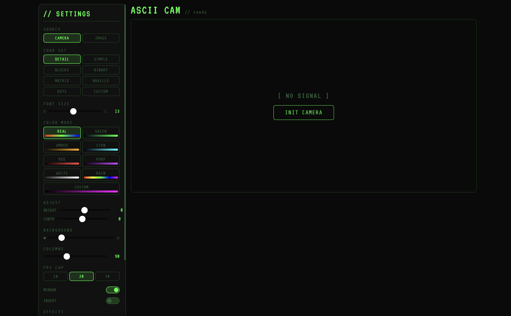

<div align="center">

# 🎨 ArtSCII CAM

**Real-time ASCII art camera & image converter — runs entirely in the browser**

[](./LICENSE)
[](./index.html)
[](./index.html)
[](./index.html)
[](./src/styles.css)
[](./src/app.js)

[](https://www.google.com/chrome/)
[](https://www.mozilla.org/firefox/)
[](https://www.apple.com/safari/)

[**🚀 Live Demo**](https://ayuuXploits.github.io/artscii-cam/) &nbsp;·&nbsp; [**🐛 Report Bug**](https://github.com/ayuuXploits/artscii-cam/issues/new?assignees=&labels=bug&template=bug_report.md&title=%5BBug%5D+) [**✨ Request Feature**](https://github.com/ayuuXploits/artscii-cam/issues/new?assignees=&labels=enhancement&template=feature_request.md&title=%5BFeature%5D+)

<br/>

*No server. No dependencies. No build step. Just open and create.*

<br/>



</div>

---

## 📋 Table of Contents

- [Features](#-features)
- [Quick Start](#-quick-start)
- [Project Structure](#-project-structure)
- [Character Sets](#-character-sets)
- [Color Modes](#-color-modes)
- [Visual Effects](#-visual-effects)
- [Controls & Adjustments](#-controls--adjustments)
- [Keyboard Shortcuts](#-keyboard-shortcuts)
- [Export Options](#-export-options)
- [Browser Support](#-browser-support)
- [Deployment](#-deployment)
- [Development](#-development)
- [License](#-license)

---

## ✨ Features

| Category | Details |
|----------|---------|
| 📷 **Live Camera** | Real-time webcam feed rendered as ASCII art |
| 🖼️ **Image Upload** | Static image → ASCII conversion |
| 🔤 **Character Sets** | 8 sets — Detailed, Simple, Blocks, Binary, Matrix, Braille, Dots, Custom |
| 🎨 **Color Modes** | 9 modes — Real, Green, Amber, Cyan, Red, Purple, White, Rainbow, Custom gradient |
| ✨ **Visual Effects** | 6 effects — Glitch, Matrix Rain, Hue Rotation, Edge Detection (Sobel), Chromatic Aberration, Scanlines |
| 🎛️ **Adjustments** | Font size, column count, brightness, contrast, background darkness |
| 🔁 **Transforms** | Mirror & Invert toggles |
| ⏱️ **FPS Cap** | 10 / 20 / 30 FPS |
| 💾 **Export** | Save as PNG or copy plain-text ASCII to clipboard |
| ⛶ **Fullscreen** | Fullscreen mode + keyboard shortcuts |
| 🚫 **Zero Deps** | Plain HTML + CSS + JS — no npm, no bundler, no framework |

---

## 🚀 Quick Start

> **Important:** The app must be served over HTTP/HTTPS — not opened as a `file://` URL. Camera access and `canvas.getImageData()` require a secure context.

### Clone & Serve

```bash
git clone https://github.com/ayuuXPploits/artscii-cam.git
cd artscii-cam
```

Then pick any local server:

```bash
# Option A — npx serve (Node.js)
npx serve .

# Option B — Python
python3 -m http.server 8080

# Option C — live-reload dev server
npx browser-sync start --server --files "**/*.html,**/*.js,**/*.css"
```

Open `http://localhost:8080` in your browser and click **INIT CAMERA**.

---

## 🗂️ Project Structure

```
artscii-cam/
├── index.html          # Shell — layout, markup, script tags
├── src/
│   ├── config.js       # Character sets, defaults, constants
│   ├── state.js        # Centralised mutable state object
│   ├── renderer.js     # Canvas drawing, Sobel edge, color functions
│   ├── effects.js      # Rain + scanline post-process overlays
│   ├── ui.js           # DOM event wiring, keyboard shortcuts
│   ├── app.js          # Camera init, image loading, rAF loop
│   └── styles.css      # All CSS (CSS custom properties, responsive)
└── docs/
    └── artscii.png     # Screenshot / documentation assets
```

Each source file has a single responsibility — no file exceeds its domain. The rendering pipeline flows: `app.js` (frame capture) → `renderer.js` (ASCII conversion) → `effects.js` (post-processing overlays).

---

## 🔤 Character Sets

| Set          | Characters used | Best for |
|--------------|---------------------|----------|
| **Detailed** | Full density ramp   | Portraits, high-detail scenes |
| **Simple**   | Short ramp          | Clean, readable output |
| **Blocks**   | `█ ▓ ▒ ░ `          | Bold, graphic feel |
| **Binary**   | `0 1`               | Tech / hacker aesthetic |
| **Matrix**   | Katakana + symbols  | Matrix rain effect |
| **Braille**  | Braille unicode     | Ultra-fine grain |
| **Dots**     | `· : ; o O`         | Minimal, elegant |
| **Custom**   | User-defined string | Anything you want |

---

## 🎨 Color Modes

| Mode | Description |
|-------------|-------------|
| **Real** | Samples actual pixel color from the source |
| **Green**    | Classic terminal green on black |
| **Amber** | Warm retro amber monochrome |
| **Cyan** | Cool cyan monochrome |
| **Red** | High-contrast red |
| **Purple** | Deep purple monochrome |
| **White** | Pure white on black |
| **Rainbow** | Hue cycles across columns |
| **Custom gradient** | User-defined start & end color |

---

## ✨ Visual Effects

| Effect | Description |
|--------|-------------|
| **Glitch** | Random horizontal character displacement |
| **Matrix Rain** | Falling katakana overlay |
| **Hue Rotation** | Animates color hue over time |
| **Edge Detection** | Sobel operator highlights outlines |
| **Chromatic Aberration** | RGB channel offset split |
| **Scanlines** | CRT-style horizontal line overlay |

Effects can be stacked and combined freely.

---

## 🎛️ Controls & Adjustments

| Control | Range / Options | Description |
|---------|----------------|-------------|
| **Font Size** | slider | Character pixel size |
| **Columns** | slider / `←` `→` keys | ASCII grid width |
| **Brightness** | slider | Source luminance offset |
| **Contrast** | slider | Source contrast multiplier |
| **Background Darkness** | slider | Canvas bg opacity |
| **Mirror** | toggle | Horizontal flip |
| **Invert** | toggle | Invert character density |
| **FPS Cap** | 10 / 20 / 30 | Limits render loop speed |

---

## ⌨️ Keyboard Shortcuts

| Key | Action |
|-----|--------|
| `Space` | Pause / Resume (camera mode) |
| `S` | Save current frame as PNG |
| `F` | Toggle fullscreen |
| `←` | Decrease column count |
| `→` | Increase column count |
 
---

## 💾 Export Options

**PNG** — Captures the canvas at current resolution and downloads as `artscii-frame.png`. Preserves colors, effects, and background exactly as rendered.

**Plain Text** — Copies raw ASCII characters (no color) to clipboard. Paste into any text editor, terminal, or document.

---

## 🌐 Browser Support

| Browser | Minimum Version | Notes |
|---------|----------------|-------|
| Chrome / Edge | 120+ | Full support |
| Firefox | 121+ | Full support |
| Safari | 17+ | Full support |

**Required browser APIs:**

- `MediaDevices.getUserMedia` — camera access
- `createImageBitmap` — fast frame decoding
- `OffscreenCanvas` — polyfilled via regular `<canvas>` where unsupported
- `navigator.clipboard` — copy-to-clipboard feature

---

## 🚢 Deployment

ArtSCII CAM is a fully static site. No build command, no environment variables.

### GitHub Pages

```
Settings → Pages → Deploy from branch → main / (root)
```

### Netlify / Vercel

```
Build command:   (leave empty)
Output directory: .  (repo root)
```

### Any static host

Upload the repo contents as-is. The only requirement is that the files are served over HTTP/HTTPS.

---

## 🛠️ Development

No build toolchain needed. Edit any file and refresh the browser.

For live-reload during development:

```bash
npx browser-sync start --server --files "**/*.html,**/*.js,**/*.css"
```

### Adding a new character set

Edit `src/config.js` and add an entry to the `CHAR_SETS` object:

```js
CHAR_SETS: {
  // existing sets...
  mySet: "your characters ordered light to dark",
}
```

### Adding a new color mode

Add a case to the color resolver in `src/renderer.js` and register it in the UI dropdown in `src/ui.js`.

### Adding a new effect

Add your post-process function to `src/effects.js` and wire it into the render loop in `src/renderer.js`.

---

## 📜 License

**Copyright © 2026 ayuuXploits — All Rights Reserved.**

This software and its associated source code, assets, and documentation are the exclusive property of ayuuXploits. 
---

<div align="center">

Built by [ayuuXploits](https://github.com/ayuuXPploits) &nbsp;·&nbsp; Drop a ⭐ if you find it useful!

</div>
